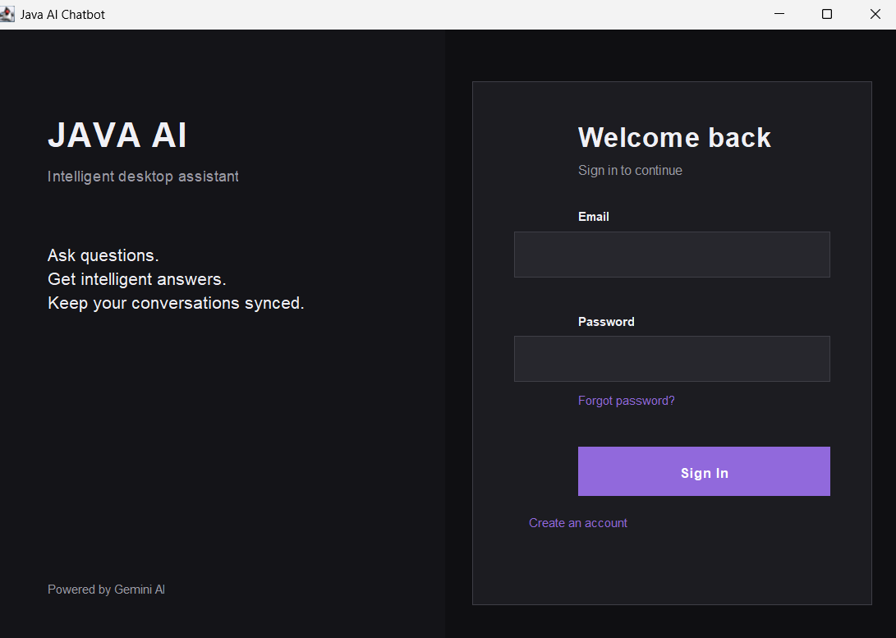
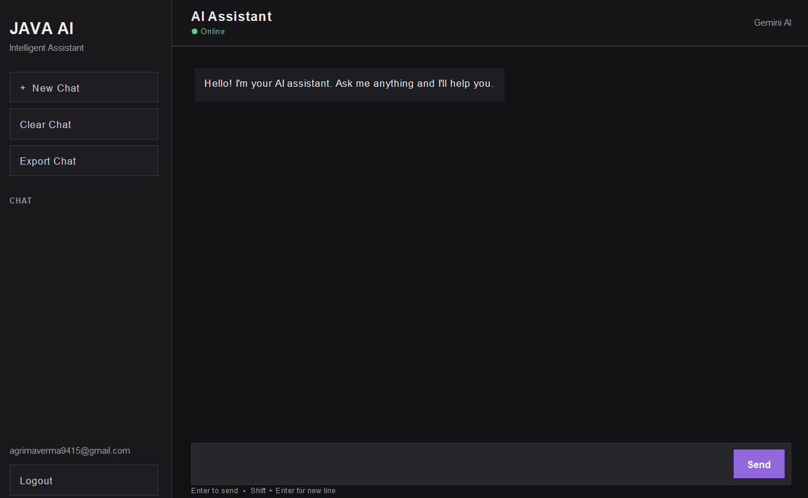
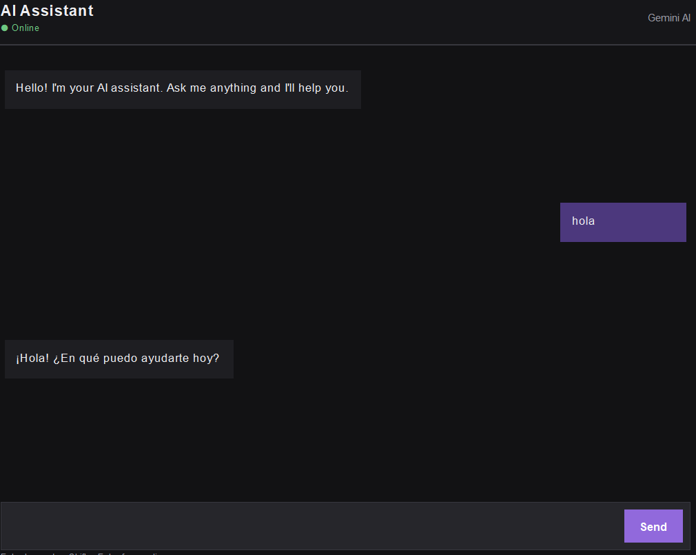

# Java AI Chatbot

A desktop-based AI chatbot built using Java Swing, Google Gemini AI, and Firebase Authentication.

The application provides a modern dark-themed chat interface with user authentication, AI-powered conversations, chat history, and chat export functionality.

## Features

- User Sign Up and Sign In
- Firebase Authentication
- Password Reset
- Google Gemini AI integration
- Real-time AI conversations
- Chat history
- New Chat
- Clear Chat
- Export Chat
- Logout functionality
- Modern dark-themed desktop interface
- Conversation context for more natural responses
- Firebase Realtime Database integration

## Technologies Used

- Java 25
- Java Swing
- Maven
- Google Gemini API
- Firebase Authentication
- Firebase Realtime Database
- Gson
- Git & GitHub

## Project Structure

```text
java-chatbot/
│
├── pom.xml
├── README.md
├── .gitignore
│
└── src/
    └── main/
        └── java/
            └── com/
                └── chatbot/
                    ├── App.java
                    ├── AuthGUI.java
                    ├── ChatbotGUI.java
                    ├── FirebaseConfig.java
                    ├── FirebaseService.java
                    └── GeminiService.java
## Screenshots

### Login & Sign Up



### AI Chatbot



### Application

